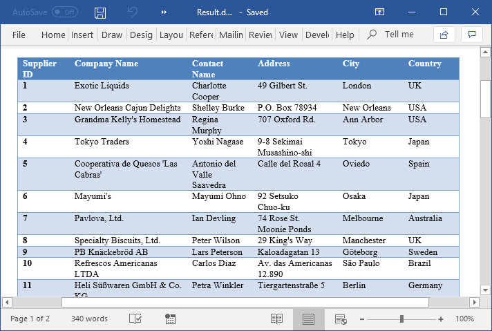
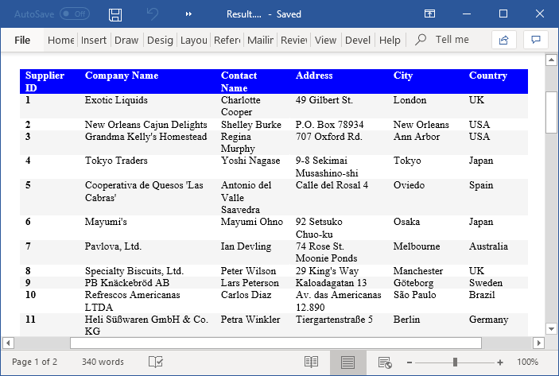

# Word table examples

This repository contains examples that illustrates how to create, edit, format, and delete tables in Word documents programmatically in C# and VB.NET using Syncfusion [.NET Word library](https://www.syncfusion.com/word-framework/net/word-library?utm_source=github&utm_medium=listing&utm_campaign=word-table-examples) (Essential DocIO) without Microsoft Word or Office interop dependencies.

# Tables in Word documents

You can create, edit, and format simple and nested tables in a Word document. Polish the appearance of tables by applying table styles and conditional formats.

The Syncfusion [Word library](https://www.syncfusion.com/word-framework/net/word-library?utm_source=github&utm_medium=listing&utm_campaign=word-table-examples) (Essential DocIO) provides comprehensive APIs to create, edit, format, and delete both simple and nested tables in Word documents programmatically in C# and VB.NET. It allows you to customize look of the tables by merging cells, adding or deleting columns or rows, or applying borders, enabling or disabling header rows to repeat on each page or row to break across pages. It generates professional reports with tabular data faster in a batch process without Microsoft Word or Office interop dependencies. The generated reports can be saved as a Word document, PDF, image, HTML, and more.

# NuGet packages

NuGet is the one of the easiest ways to download and install Syncfusion [Word library](https://www.syncfusion.com/word-framework/net/word-library?utm_source=github&utm_medium=listing&utm_campaign=word-table-examples) (Essential DocIO) to read, write, and edit Word documents. The following NuGet packages need to be installed in your application.

|Platform(s)|Package name|
|-----------|------------|
|Windows Forms|[Syncfusion.DocIO.WinForms.nupkg](https://www.nuget.org/packages/Syncfusion.DocIO.WinForms/)|
|WPF|[Syncfusion.DocIO.Wpf.nupkg](https://www.nuget.org/packages/Syncfusion.DocIO.Wpf/)|
|ASP.NET |[Syncfusion.DocIO.AspNet.nupkg](https://www.nuget.org/packages/Syncfusion.DocIO.AspNet/)|
|ASP.NET MVC4|[Syncfusion.DocIO.AspNet.Mvc4.nupkg](https://www.nuget.org/packages/Syncfusion.DocIO.AspNet.Mvc4/)|
|ASP.NET MVC5|[Syncfusion.DocIO.AspNet.Mvc5.nupkg](https://www.nuget.org/packages/Syncfusion.DocIO.AspNet.Mvc5/)|
|ASP.NET Core and Blazor|[Syncfusion.DocIO.Net.Core.nupkg](https://www.nuget.org/packages/Syncfusion.DocIO.Net.Core/)|
|Xamarin|[Syncfusion.Xamarin.DocIO.nupkg](https://www.nuget.org/packages/Syncfusion.Xamarin.DocIO/)|
|UWP|[Syncfusion.DocIO.UWP.nupkg](https://www.nuget.org/packages/Syncfusion.DocIO.UWP/)|

# Key Features

- [Apply built-in table style in C#](Apply-built-in-table-style/) - Apply built-in table style to a table in Word document.

- [Modify an existing table style in C#](Modify-existing-table-style/) - Access an existing table style from a Word document and modify its properties.

- [Create new custom table style in C#](Create-new-custom-table-style/) - Create new custom table style and apply to a table in Word document.

- [Copy table styles in C#](Copy-table-styles/) - Copy table styles from one Word document to another.

# Screenshots

**Built-in table style**

 
 

**Custom table style**

 
 

# Resources

- **Product page:** [Syncfusion Word Framework](https://www.syncfusion.com/word-framework/net?utm_source=github&utm_medium=listing&utm_campaign=word-table-examples)

- **Documentation:** [Tables in Word document using Syncfusion Word library](https://help.syncfusion.com/file-formats/docio/working-with-tables?utm_source=github&utm_medium=listing&utm_campaign=word-table-examples)

- **Online demo:** [Essential DocIO-Online demos](https://www.syncfusion.com/demos/fileformats/word-library?utm_source=github&utm_medium=listing&utm_campaign=word-table-examples)

- **Download:** [Syncfusion File Formats Controls](https://www.syncfusion.com/sales/products/fileformats?utm_source=github&utm_medium=listing&utm_campaign=word-table-examples)

# Support and feedback

* For queries, contact our [Syncfusion support team](https://www.syncfusion.com/support/directtrac/incidents/newincident?utm_source=github&utm_medium=listing&utm_campaign=word-table-examples) or post the queries through [community forums](https://www.syncfusion.com/forums?utm_source=github&utm_medium=listing&utm_campaign=word-table-examples).

* To renew the subscription, click [here](https://www.syncfusion.com/sales/products?utm_source=github&utm_medium=listing&utm_campaign=word-table-examples) or contact our sales team at [salessupport@syncfusion.com](mailto:salessupport@syncfusion.com).

# License

This is a commercial product and requires a paid license for possession or use. Syncfusion’s licensed software, including this component, is subject to the terms and conditions of [Syncfusion's EULA](https://www.syncfusion.com/eula/es?utm_source=github&utm_medium=listing&utm_campaign=word-table-examples). You can purchase a license [here](https://www.syncfusion.com/sales/products?utm_source=github&utm_medium=listing&utm_campaign=word-table-examples) or start a free 30-day trial [here](https://www.syncfusion.com/account/manage-trials/start-trials?utm_source=github&utm_medium=listing&utm_campaign=word-table-examples).
